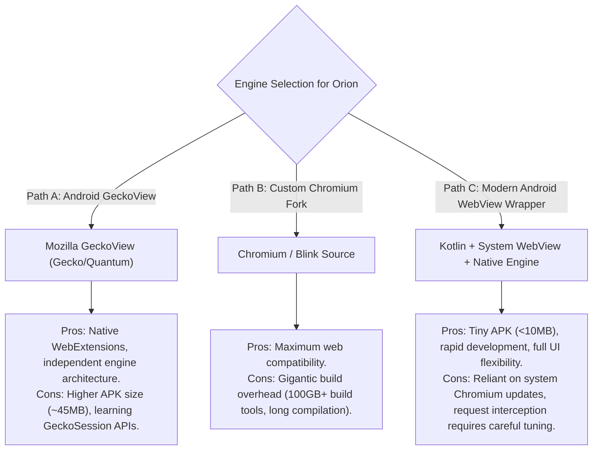
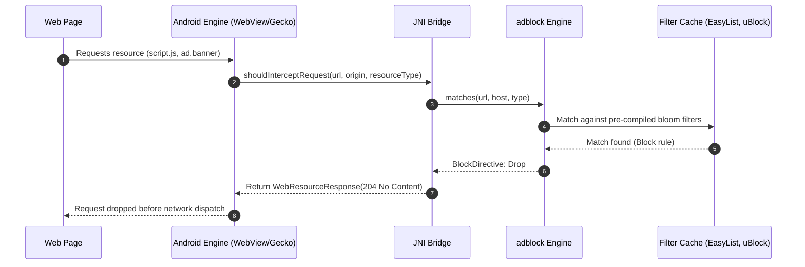
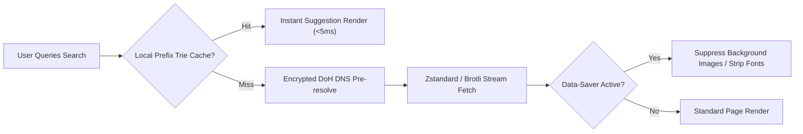
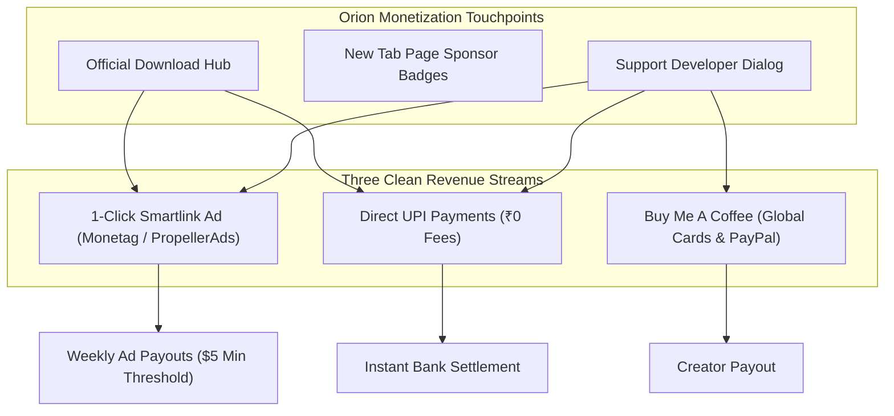
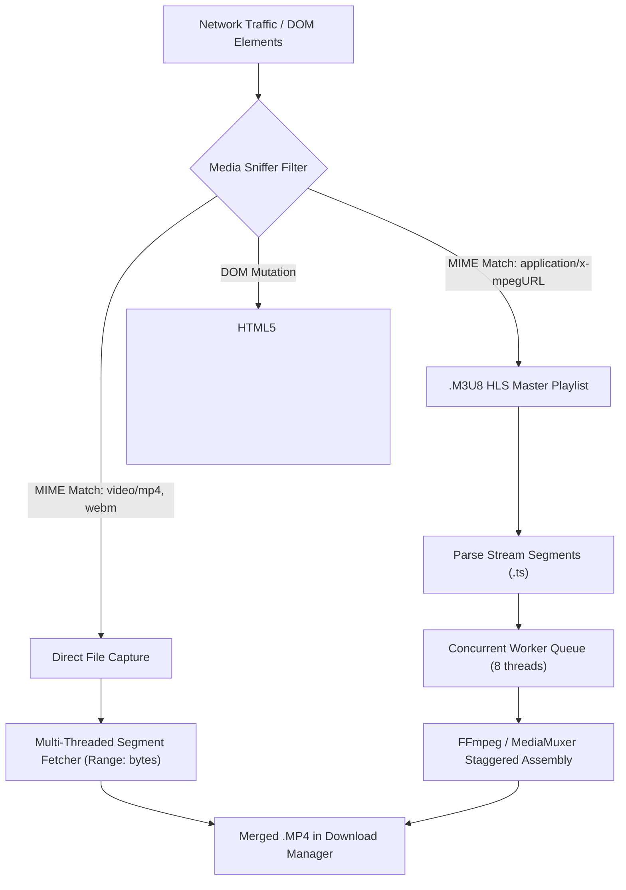

# Orion Browser: Architecture & Implementation Blueprint

A comprehensive engineering specification for developing **Orion**, a high-performance, privacy-inspired Android web browser featuring:
1. **Tor-inspired minimalist UI/UX**
2. **Sub-millisecond native Rust ad/tracker blocking**
3. **Turbo low-network search acceleration**
4. **Compliant publisher monetization & developer patronage architecture**
5. **Multi-threaded HLS/MP4 media sniffer & fast downloader**

---

## 1. Engine & Stack Selection

Building a browser requires choosing between three foundational paths:



### Recommended Decision:
* **For an immediate, modular MVP**: **Path C** (Kotlin + Jetpack Compose + Android `WebView` with JNI Native Rust `adblock-rust`).
* **For an authentic Tor/independent fork**: **Path A** (Mozilla `GeckoView`), which natively runs Tor's circuit architecture and add-ons.

---

## 2. UI/UX Design System: Tor-Inspired Aesthetic

The Tor Browser interface is defined by **minimalism, purple/dark charcoal tones, security visibility, and zero clutter**.

```
+-------------------------------------------------------------+
|  [ Shield: Standard v ]       [ https://example.com ]  ( : ) |
+-------------------------------------------------------------+
|                                                             |
|                                                             |
|                      WEB VIEW CONTENT                       |
|                                                             |
|                                                             |
+-------------------------------------------------------------+
|  [ < ]    [ > ]    [ Search / Home ]    [ (3) Tabs ]   [ = ] |
+-------------------------------------------------------------+
```

### Color Palette & Visual Identity
* **Background Dark Primary**: `#120E16` (Deep Obsidian Violet)
* **Surface / Cards**: `#1E1826` (Muted Tor Slate)
* **Accent / Brand**: `#7D4698` / `#9C5FB8` (Onion Purple)
* **Security Badges**:
  * Safe / Shield Active: `#27AE60` (Vibrant Emerald)
  * Warning / Mixed Content: `#E67E22` (Amber)
  * Danger / Phishing Blocked: `#E74C3C` (Crimson)
* **Text**: `#F5F3F7` (Primary Off-white), `#9E97A6` (Secondary Muted)

### Core UI Components
1. **Dynamic Bottom App Bar**: Easy one-handed thumb navigation containing Back, Forward, Fast Search trigger, Tab Switcher, and Main Menu.
2. **Security & Shield Level Slider**:
   * **Standard**: Default ad/tracker blocking; all web features enabled.
   * **Safer**: Disables JavaScript on unencrypted (HTTP) sites, disables WebGL, blocks audio/video autoplay.
   * **Safest**: Disables JavaScript globally across all pages; strips complex fonts and icons.
3. **One-Tap "Nuke" / Identity Reset**: A dedicated floating or menu button that clears cookies, local storage, history, and cache instantly in a single transaction.

---

## 3. High-Performance Ad-Blocking Engine: Architecture & Integration

Orion achieves market-leading speed by executing ad-blocking **in native compiled rules**, avoiding the high latency of JavaScript-based blocking.



### Implementation Architecture:
1. **The Core Engine**:
   * Parses standard filter rules (`EasyList`, `EasyPrivacy`, `Peter Lowe's List`).
   * Uses serialized binary DAT files and Bloom filters for sub-millisecond rule matching.
2. **Cross-Compilation for Android**:
   * Compile `adblock-rust` for Android architectures (`arm64-v8a`, `armeabi-v7a`, `x86_64`) using `cargo-ndk`.
   * Create JNI bindings exposing two primary methods:
     ```rust
     // Rust JNI wrapper signature
     #[no_mangle]
     pub extern "C" fn Java_org_orion_browser_adblock_AdBlocker_shouldBlock(
         env: JNIEnv,
         _: JClass,
         url: JString,
         source_url: JString,
         resource_type: JString,
     ) -> jboolean;
     ```
3. **Cosmetic / Element Hiding**:
   * For ad containers that collapse after network blocking, inject pre-compiled cosmetic CSS selectors:
     ```javascript
     // Injected via evaluateJavascript on PageFinished
     const style = document.createElement('style');
     style.innerHTML = '##.ad-banner, [id^="google_ads_"], .sponsored-post { display: none !important; }';
     document.head.appendChild(style);
     ```

---

## 4. High-Speed Fast Search & Low-Network Optimization

To ensure blazing search and smooth browsing under poor network conditions (2G/3G or throttled cellular):



### Key Acceleration Strategies:
1. **Predictive Search via Local Prefix Trie**:
   * Store popular queries and top domain mappings in an offline SQLite/Room Trie database. Suggestions render with **zero network latency** while typing.
2. **DNS-over-HTTPS (DoH) with Connection Pre-warming**:
   * Use Cloudflare (`1.1.1.1`) or Quad9 DoH to bypass slow ISP DNS resolvers.
   * Pre-resolve domain IPs and open TLS connections in the background as soon as the user starts typing a destination URL.
3. **Aggressive Low-Network "Turbo / Data Saver" Engine**:
   * Send the standard HTTP header: `Save-Data: on`.
   * Intercept image requests: On low-bandwidth networks, dynamically replace remote 4K/HD images with a lightweight 1x1 placeholder and a "Tap to Load Image" overlay.
   * Enforce modern stream compression: Request `Accept-Encoding: gzip, deflate, br, zstd`.

---

## 5. Monetization & Developer Patronage Architecture (Policy & Compliance Strategy)

> [!WARNING]
> ### Critical Ad Network & App Store Guidelines
> 1. **No In-Viewport Web Overlays**: Never inject banners directly into third-party web content viewports (classified as invalid inventory/traffic).
> 2. **No False Incentives**: Traffic must be authentic and user-driven.
> 
> To generate recurring project revenue while respecting user privacy, Orion implements a **Triple-Stream Monetization Architecture**.



### Compliant Revenue Channels:
1. **1-Click Smartlink / Direct Link (Monetag)**:
   * Non-intrusive direct link sponsorship. When users choose to support development by viewing an ad, they open an isolated external link (Zone ID routing) without corrupting internal browser tabs.
2. **Direct UPI & QR Code Integration**:
   * Direct UPI integration (`abhinava6525@naviaxis`) allowing Indian users to send voluntary financial support directly to the developer with zero middleman commissions.
3. **Global Creator Patronage (Buy Me A Coffee)**:
   * Enables international supporters to contribute via Visa, Mastercard, Apple Pay, and PayPal.

---

## 6. Fast Video Downloader & Sniffer Engine

Inspired by modern high-speed utility downloaders:



> [!CAUTION]
> ### Google Play Store YouTube Policy
> The Google Play Developer Distribution Agreement strictly forbids apps that facilitate downloading copyrighted videos from **YouTube**.
> * **For Google Play Store Release**: The media sniffer **must blacklist `youtube.com` and `youtu.be`**.
> * **For Full Unrestricted Downloads (including YouTube)**: Provide an alternative APK distributed via your website, GitHub, or F-Droid that enables full extraction.

### Technical Implementation:
1. **Network Request Sniffer (`shouldInterceptRequest`)**:
   * Intercept outgoing URLs and inspect response headers:
     * File extensions: `.mp4`, `.webm`, `.m3u8`, `.mpd`, `.ts`.
     * Content-Type: `video/*`, `application/vnd.apple.mpegurl`.
   * When detected, trigger a floating UI indicator ("Video Found" badge with resolution and file size).
2. **DOM-Level Blob URL Sniffer**:
   * Modern websites use `blob:https://...` wrapped in MediaSource Extensions (MSE).
   * Inject a JavaScript sniffer at `document_start` hooking the `MediaSource` and `HTMLMediaElement.prototype.play` methods to capture the streaming source URLs before they are buffered.
3. **Multi-Threaded Chunk Downloader (Speed Acceleration)**:
   * Query server support for `Accept-Ranges: bytes`.
   * Split the video into 4–8 equal byte chunks and issue simultaneous asynchronous HTTP requests:
     * Thread 1: `Range: bytes=0-10485759`
     * Thread 2: `Range: bytes=10485760-20971519`
   * Merge raw byte streams directly to an indexed file using Android's `RandomAccessFile`.
4. **HLS (.m3u8) Stream Stitcher**:
   * Download the `.m3u8` playlist index.
   * Parse the discrete `.ts` (Transport Stream) video segments.
   * Concurrently fetch segments using a coroutine worker pool.
   * Merge segments into a single file and re-encode/remux the audio-video container using the Android `MediaMuxer` or `ffmpeg-kit-android`.

---

## 7. High-Impact "Must-Have" Features to Outcompete Rivals

To stand out in the crowded browser market against mainstream browsers, Orion needs these user-favorite power features:

### 1. Background Audio & Screen-Off Playback
* **Problem**: Standard browsers and YouTube stop playing music or podcasts the moment users turn off their phone screen or switch to another app.
* **Orion Solution**:
  * Hook the `HTMLMediaElement` and override the browser visibility API (`document.hidden`, `visibilitychange`).
  * Run media playback inside an Android **Foreground Service** (`MediaSessionCompat`).
  * Provide system lock-screen notification controls (Play/Pause, Next, Seek bar).

### 2. Biometric Security Vault (Fingerprint Secret Mode)
* **Problem**: Normal "incognito" mode is lost if the app closes, and downloaded private files sit unprotected in the phone's gallery.
* **Orion Solution**:
  * **Secret Mode with Biometric Authentication**: Require fingerprint / Face Unlock / PIN to enter Secret Tabs.
  * **Encrypted Private Downloads Vault**: Files downloaded in Secret Mode are encrypted with AES-256 (GCM) using Android Keystore keys and hidden from the public Android MediaStore.

### 3. Native OLED True-Black Dark Mode
* **Problem**: Most website dark modes are dark gray or non-existent, wasting battery on AMOLED screens.
* **Orion Solution**:
  * Universal dynamic CSS shader that forces genuine `#000000` deep black backgrounds on all websites.
  * Inverts bright images at night and adjusts contrast automatically to prevent eye strain.

### 4. Anti-Fingerprinting Armor (Tor-Level Protection)
* **WebRTC Leak Shield**: Enforces `disableWebRtc` or proxy-routes STUN/TURN queries to prevent revealing the user's real ISP IP address even when a VPN is active.
* **Canvas & Audio Context Randomization**: Injects microscopic random noise into HTML5 Canvas and WebAudio API outputs, breaking tracking scripts that attempt to generate unique hardware fingerprints.
* **Referrer Trimming**: Trims URLs to origin-only (e.g. sends only `https://example.com/` instead of full query paths with tracking identifiers like `?fbclid=` or `?utm_source=`).

### 5. In-App Video-to-Audio (MP3) Extractor
* When downloading videos with the media sniffer, provide a one-tap **"Download as MP3 / M4A"** option.
* Automatically extracts and remuxes the AAC/Opus audio track without re-encoding, saving 90% of file storage and mobile data.

### 6. Distraction-Free Reader Mode with Offline Text-to-Speech (TTS)
* Cleanses news articles and blog posts of all ads, sidebars, and popups.
* Integrates Android's native Text-to-Speech engine so users can listen to articles like a podcast while commuting or working out.

### 7. Zero-Knowledge E2EE Sync Chain (No Email/Password Required)
* Follows a **Zero-Knowledge Sync** paradigm: No personal email, phone number, or password required.
* Devices join a sync chain via a **QR code scan** or a **24-word encrypted mnemonic phrase**.
* Bookmarks, rewards ledger, and settings are end-to-end encrypted before leaving the device.

### 8. Gestures & One-Handed Ergonomics
* **Swipe Address Bar**: Swipe left/right on the bottom URL bar to switch tabs instantly.
* **Pull-to-Refresh**: Smooth physics-based pull-down refresh with haptic feedback.
* **Double-Tap Back**: Quickly closes the current tab and returns to the home screen.

---

## 8. Complete Technology Stack & Project Structure

```
OrionBrowser/
├── app/
│   ├── src/main/
│   │   ├── java/org/orion/browser/
│   │   │   ├── ui/                         # Jetpack Compose UI
│   │   │   │   ├── components/             # Bottom bar, shield slider, tab carousel
│   │   │   │   ├── theme/                  # Tor Dark Violet & OLED Black theme
│   │   │   │   └── webview/                # Custom BrowserView wrapper
│   │   │   ├── adblock/                    # JNI bridge to adblock-rust
│   │   │   │   ├── AdBlockEngine.kt
│   │   │   │   └── CosmeticFilters.kt
│   │   │   ├── network/                    # DNS-over-HTTPS & stream optimization
│   │   │   │   ├── DoHResolver.kt
│   │   │   │   ├── LowNetworkInterceptor.kt
│   │   │   │   └── WebRtcShield.kt
│   │   │   ├── downloader/                 # Media sniffer & chunk engine
│   │   │   │   ├── MediaSniffer.kt
│   │   │   │   ├── HlsDownloader.kt
│   │   │   │   ├── SegmentDownloader.kt
│   │   │   │   └── AudioExtractor.kt
│   │   │   ├── media/                      # Background playback & lockscreen controls
│   │   │   │   └── MediaPlaybackService.kt
│   │   │   ├── vault/                      # Biometric secret mode & AES-256 storage
│   │   │   │   ├── BiometricAuthManager.kt
│   │   │   │   └── EncryptedFileManager.kt
│   │   │   ├── reader/                     # Clean reader view & Text-to-Speech
│   │   │   │   ├── ReadabilityExtractor.kt
│   │   │   │   └── TtsPlayer.kt
│   │   │   └── support/                    # Developer patronage & direct monetization
│   │   │       └── SupportDeveloperDialog.kt
│   │   ├── cpp/                            # Native C++/Rust JNI bindings
│   │   │   ├── CMakeLists.txt
│   │   │   └── adblock_jni.cpp
│   │   └── assets/                         # Compiled EasyList .dat filter lists
│   └── build.gradle.kts
└── rust_adblock/                           # Standalone Rust subproject
    ├── Cargo.toml
    └── src/lib.rs                          # Compiled via cargo-ndk to .so
```

---

## 9. Comprehensive Implementation Roadmap

| Phase | Milestone | Deliverables |
| :--- | :--- | :--- |
| **Phase 1** | **Core UI & Engine Shell** | Setup Jetpack Compose project, implement Tor-inspired Obsidian/Violet theme, bottom URL bar, and customizable security shield menu. |
| **Phase 2** | **Rust Adblock & Shields** | Cross-compile `adblock-rust` with `cargo-ndk`, bind via JNI, plug into `shouldInterceptRequest`, and bundle initial EasyList filter binary. |
| **Phase 3** | **Network & Low-Bandwidth Turbo** | Implement Cloudflare DoH resolver, add local prefix suggestion Trie, configure `Save-Data` and dynamic image-blocking toggles. |
| **Phase 4** | **Media Sniffer & Fast Downloader**| Implement MIME type detector, DOM media hook, multi-threaded 8-chunk HTTP range downloader, and `.m3u8` parser. |
| **Phase 5** | **Media & Vault Experience** | Add Background Audio Foreground Service, Picture-in-Picture (PiP), and Biometric Vault for private downloads. |
| **Phase 6** | **Reader View & Anti-Fingerprinting**| Integrate Readability engine, native TTS article read-aloud, WebRTC IP leak blocking, and Canvas noise injection. |
| **Phase 7** | **Compliant Monetization & Release**| Build developer patronage portal (UPI & Buy Me A Coffee), 1-click Monetag smartlink routing, Google Play YouTube guard, and release APK. |

---

## 📄 Copyright & Proprietary Rights

**Copyright &copy; 2026 Abhinav Santhosh. All Rights Reserved.**  
This architecture specification, technical design, and implementation codebase are proprietary and confidential. Unauthorized copying, reproduction, distribution, reverse engineering, or modification is strictly prohibited.
