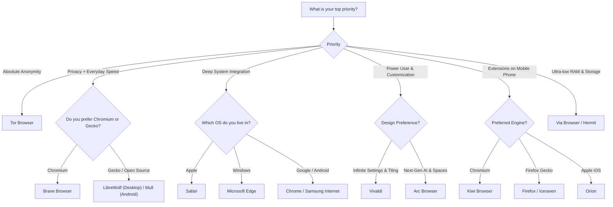

# The Ultimate Web Browser Directory & In-Depth Comparative Analysis

A comprehensive evaluation of the web browser landscape spanning mobile (Google Play Store, F-Droid, iOS App Store) and desktop platforms (Windows, macOS, Linux).

---

## 1. Architectural Taxonomy: The Engine Hierarchy

Every web browser is built upon two core engines:
1. **Rendering Engine**: Parses HTML, CSS, images, and formats them onto the screen.
2. **JavaScript Engine**: Compiles and executes script code.

```mermaid
flowchart TD
    subgraph Engines["Core Engine Families"]
        Blink["Blink + V8 (Chromium Core)"]
        Gecko["Gecko/Quantum + SpiderMonkey"]
        WebKit["WebKit + JavaScriptCore"]
        Indie["Independent / Lightweight Engines"]
    end

    Blink --> Chrome["Google Chrome"]
    Blink --> Brave["Brave Browser"]
    Blink --> Edge["Microsoft Edge"]
    Blink --> Vivaldi["Vivaldi"]
    Blink --> Opera["Opera / Opera GX / One"]
    Blink --> Samsung["Samsung Internet"]
    Blink --> Arc["Arc Browser"]
    Blink --> Kiwi["Kiwi / Cromite"]

    Gecko --> Firefox["Mozilla Firefox"]
    Gecko --> Tor["Tor Browser"]
    Gecko --> LibreWolf["LibreWolf"]
    Gecko --> Mullvad["Mullvad Browser"]
    Gecko --> Mull["Mull / Fennec / Iceraven"]
    Gecko --> Waterfox["Waterfox"]

    WebKit --> Safari["Apple Safari"]
    WebKit --> Orion["Orion Browser"]
    WebKit --> GnomeWeb["GNOME Web (Epiphany)"]

    Indie --> Ladybird["Ladybird (LibWeb)"]
    Indie --> NetSurf["NetSurf"]
    Indie --> Lynx["Lynx / w3m (Terminal)"]
```

> [!NOTE]
> On iOS, Apple historically enforced the WebKit rule (every browser on the App Store had to use WebKit under the hood). While European Union DMA regulations are beginning to open iOS to native Blink and Gecko engines, outside the EU almost all iOS browsers remain WebKit shells wrapped in custom UI.

---

## 2. Browser Categories at a Glance

| Category | Primary Examples | Core Focus |
| :--- | :--- | :--- |
| **Mainstream Giants** | Chrome, Edge, Safari, Samsung Internet | Ecosystem sync, enterprise integration, baseline compatibility |
| **Privacy & Anti-Tracking** | Brave, Tor Browser, LibreWolf, Mullvad, DuckDuckGo, Mull | Zero telemetry, fingerprinting protection, ad/tracker blocking |
| **Power Users & Customization** | Vivaldi, Arc, Opera One, Kiwi Browser | Workspaces, tab tiling, sidebar vertical tabs, custom CSS |
| **Gamer & Performance** | Opera GX | RAM/CPU limiters, Twitch/Discord integration, custom soundscapes |
| **Ultra-Lightweight & Minimalist** | Via Browser, Soul Browser, Hermit, Opera Mini | Tiny APK footprint (<10MB), ultra-low RAM usage, speed |
| **Mobile Power (Extension Masters)** | Kiwi Browser, Firefox Mobile, Iceraven, Orion (iOS) | Desktop Chrome/Firefox extensions on mobile screens |
| **Next-Gen & AI-Integrated** | Arc (Dia/Max), Edge (Copilot), Opera One (Aria), SigmaOS | Contextual AI summarization, canvas workspaces, smart splits |
| **Independent & FOSS Rebels** | Ladybird, Pale Moon, Cromite, Fennec F-Droid | Complete independence from Big Tech monopolies |

---

## 3. In-Depth Individual Browser Profiles

### Group A: Privacy-Centric & Hardened Browsers

---

#### 1. Brave Browser
* **Engine**: Blink / V8 (Chromium fork)
* **Platforms**: Android (Play Store / APK), iOS, Windows, macOS, Linux
* **License**: Open Source (MPL 2.0 / Chromium)
* **Default Search Engine**: Brave Search (independent index)

* **Key Features**:
  * **Brave Shields**: Native Rust-based ad, tracker, and script blocker (equivalent to uBlock Origin performance).
  * **Fingerprinting Defense**: Randomizes browser canvas and audio fingerprints per domain.
  * **Built-in Tor Windows**: Desktop version supports routing private tabs through Tor nodes.
  * **Web3 Integration**: Brave Wallet, Basic Attention Token (BAT) opt-in rewards system.
  * **Brave Leo**: Built-in, privacy-preserving AI assistant.
* **Pros**:
  * Out-of-the-box protection without requiring third-party extensions.
  * Near 100% web compatibility due to Chromium codebase.
  * Mobile version allows background video play (e.g. YouTube with screen off).
* **Cons**:
  * Cryptocurrency/Web3 bloat (can be disabled, but present by default).
  * Past controversies regarding affiliate link autocompletion and VPN installation on Windows.
* **Verdict**: Best everyday plug-and-play browser for users wanting strong privacy without sacrificing website compatibility.

---

#### 2. Tor Browser
* **Engine**: Gecko ESR / Quantum (Firefox ESR base)
* **Platforms**: Android (Play Store / F-Droid / APK), Windows, macOS, Linux (iOS users use the endorsed *Onion Browser*)
* **License**: Free and Open Source (MPL 2.0 / BSD)
* **Default Search Engine**: DuckDuckGo Onion / Startpage

* **Key Features**:
  * **Triple-Hop Onion Routing**: Encrypts traffic three times and bounces it through Guard, Middle, and Exit relays.
  * **Uniform Fingerprint**: Standardizes screen resolution, user-agent, fonts, and headers so all Tor users look identical to trackers.
  * **No Disk Persistence**: History, cache, and cookies are wiped automatically upon closing the session.
  * **Access to `.onion` hidden services**.
* **Pros**:
  * The gold standard for nation-state censorship bypass and anonymous whistleblowing.
  * Immune to ISP tracking and local network eavesdropping.
* **Cons**:
  * Substantially slower browsing speeds due to multi-node relay encryption.
  * Heavy Cloudflare and Google reCAPTCHA triggers.
  * Many streaming platforms and online banking portals outright block Tor exit nodes.
* **Verdict**: Essential for extreme anonymity, whistleblowing, and circumventing totalitarian censorship; not practical as a primary streaming/banking browser.

---

#### 3. LibreWolf
* **Engine**: Gecko / Quantum
* **Platforms**: Windows, macOS, Linux (Community builds available)
* **License**: Free & Open Source (MPL 2.0)
* **Default Search Engine**: DuckDuckGo / SearxNG

* **Key Features**:
  * Independent community fork of Firefox with all telemetry, experiments, and cloud dependencies stripped out.
  * Pre-configured with hardened `user.js` settings (Arkenfox base).
  * Integrated **uBlock Origin** pre-installed and locked into optimal protection mode.
  * ResistFingerprinting (RFP) enabled by default.
* **Pros**:
  * Zero Mozilla telemetry, zero Google SafeBrowsing phone-homes (uses local caches).
  * Retains full desktop Firefox extension ecosystem.
* **Cons**:
  * Desktop-focused (no direct official mobile build).
  * Default strict settings may cause minor website breakage (e.g., timezone/canvas mismatches).
* **Verdict**: The top desktop choice for Firefox purists who want maximum privacy without configuring config files themselves.

---

#### 4. Mullvad Browser
* **Engine**: Gecko / Quantum (Firefox ESR)
* **Platforms**: Windows, macOS, Linux
* **License**: Free & Open Source (Developed in collaboration with the Tor Project)
* **Default Search Engine**: Mullvad Leta / DuckDuckGo

* **Key Features**:
  * Applies Tor Browser's advanced anti-fingerprinting protections to standard (clearnet) web browsing.
  * Does **not** route through the Tor network, eliminating Tor's typical latency penalties.
  * Resets cookies and cache on every browser restart.
* **Pros**:
  * Exceptional fingerprinting resistance backed by the Tor Project’s engineering team.
  * Designed to be paired with any high-tier VPN service.
* **Cons**:
  * Requires re-logging into websites after every browser restart.
  * No mobile version available yet.
* **Verdict**: Best for daily private desktop browsing when you want Tor-level fingerprint masking at full gigabit internet speeds.

---

#### 5. DuckDuckGo Private Browser
* **Engine**:
  * Android: System WebView (Blink-based)
  * iOS: WebKit
  * Windows/macOS: Native platform web views (Chromium/Edge WebView2 on Windows, WebKit on Mac)
* **Platforms**: Android, iOS, Windows, macOS
* **License**: Partially Open Source (App client code public)

* **Key Features**:
  * **Fire Button**: One-tap animation that instantly incinerates all open tabs, cookies, and cached data.
  * **Duck Player**: Built-in YouTube player wrapper that removes targeted ads and tracking cookies.
  * **App Tracking Protection (Android)**: Acts as a local VPN service to block tracking across *other* third-party apps on your phone.
  * **Email Protection (`@duck.com`)**: Built-in email aliasing and tracker stripper.
* **Pros**:
  * Ultra-clean, intuitive, zero-learning-curve user interface.
  * Extremely lightweight battery and storage impact.
* **Cons**:
  * Lacks advanced extension support on desktop and mobile.
  * Less customizable than Brave or Firefox.
* **Verdict**: The ideal browser for everyday non-technical users who want seamless, hassle-free privacy without managing complex settings.

---

#### 6. Cromite (Successor to Bromite)
* **Engine**: Blink / Chromium (Hardened)
* **Platforms**: Android (GitHub, F-Droid repo), Windows
* **License**: Open Source (GPL-3.0)

* **Key Features**:
  * De-Googled Chromium fork with automated ad-blocking filter lists.
  * DNS-over-HTTPS (DoH) support with custom provider selection.
  * Stripped Google metrics, click-tracking, and search engine integration hooks.
* **Pros**:
  * Pure native Chromium UI without any bloat, ads, crypto, or sponsored tiles.
  * Excellent touch performance and fluid scrolling on Android.
* **Cons**:
  * Not available on the Google Play Store (must be installed via F-Droid or GitHub Releases).
  * Manual or F-Droid repo updates required.
* **Verdict**: The cleanest, purest de-Googled Chromium browser for Android power users.

---

### Group B: Mainstream Ecosystem Browsers

---

#### 7. Google Chrome
* **Engine**: Blink / V8
* **Platforms**: Android, iOS, Windows, macOS, Linux, ChromeOS
* **License**: Proprietary (built on open-source Chromium)
* **Market Share**: >65% global dominance

* **Key Features**:
  * Deep Google Account ecosystem sync (passwords, payment methods, bookmarks, tabs, Google Assistant).
  * Live Captioning and Google Lens visual search integration.
  * Automatic webpage translation powered by Google Translate.
  * Chrome Web Store with the largest extension catalog in the world.
* **Pros**:
  * Industry benchmark for web standards compatibility; every developer builds for Chrome first.
  * Fast JavaScript V8 execution and rapid security patch deployment.
* **Cons**:
  * Extensive user telemetry, profiling, and advertising tracking.
  * Phasing in Manifest V3, which curtails declarativeNetRequest rules used by advanced ad-blockers.
  * Memory/RAM-hungry under heavy multi-tab workloads.
  * Android version completely blocks extension installations.
* **Verdict**: Unbeatable ecosystem integration and compatibility; poor for data privacy.

---

#### 8. Mozilla Firefox
* **Engine**: Gecko / Quantum / SpiderMonkey
* **Platforms**: Android, iOS (WebKit wrapper), Windows, macOS, Linux
* **License**: Free and Open Source (MPL 2.0)

* **Key Features**:
  * **Multi-Account Containers**: Isolates cookies per container (e.g. Work, Banking, Social), preventing cross-site tracking.
  * **Enhanced Tracking Protection (ETP)**: Built-in blocking of cryptominers, fingerprinting scripts, and third-party trackers.
  * **Full Mobile Extension Support**: Android version supports verified extensions directly via addons.mozilla.org (including uBlock Origin, Dark Reader, Privacy Badger).
  * Full independence from the Chromium monoculture.
* **Pros**:
  * Protects web decentralization and prevents Chromium from becoming an uncontested monopoly.
  * Full support for Manifest V2 ad-blocking mechanisms.
  * Outstanding UI customization (CSS userChrome modifications on desktop).
* **Cons**:
  * Occasionally experiences slower initial page loads or subtle layout quirks on sites poorly tested outside of Chrome.
  * Mobile performance can lag slightly behind Blink on budget Android hardware.
* **Verdict**: The undisputed champion of open web preservation, desktop user autonomy, and mobile extension support.

---

#### 9. Microsoft Edge
* **Engine**: Blink / V8
* **Platforms**: Windows, macOS, Linux, Android, iOS
* **License**: Proprietary (Chromium base)

* **Key Features**:
  * **Copilot & AI Tools**: Sidebar generative AI for PDF summarization, rewrite assistance, and image generation.
  * **Sleeping Tabs**: Aggressively suspends background tabs, making it noticeably lighter on battery and RAM than standard Chrome.
  * **Vertical Tabs & Split Screen**: Native side-by-side dual-pane browsing in a single window.
  * **Built-in PDF Editor**: High-precision PDF ink drawing, text highlighting, and signature filling.
* **Pros**:
  * Best-in-class performance and battery optimization on Windows laptops.
  * Compatible with all Chrome Web Store extensions.
* **Cons**:
  * Heavy UI clutter with shopping popups, news feeds, and Microsoft push notifications (requires manual disabling).
  * Heavy data telemetry sent to Microsoft servers.
* **Verdict**: A feature-rich, high-performance daily driver for Windows users who want Chrome's engine without its memory hunger.

---

#### 10. Apple Safari
* **Engine**: WebKit / JavaScriptCore
* **Platforms**: macOS, iOS, iPadOS (Apple exclusive)
* **License**: Proprietary (WebKit engine is LGPL/BSD)

* **Key Features**:
  * **Intelligent Tracking Prevention (ITP)**: Machine-learning based cookie and tracker mitigation.
  * **iCloud Private Relay**: Dual-hop proxy system for iCloud+ subscribers masking DNS queries and IP addresses.
  * **Hardware Acceleration**: Deeply integrated into Apple Silicon (M-series / A-series) hardware decoders.
* **Pros**:
  * The most battery-efficient browser on MacBook, iPhone, and iPad.
  * Flawless Apple ecosystem handoff (copy on iPhone, paste on Mac; shared tab groups).
* **Cons**:
  * Strictly locked to the Apple hardware ecosystem; unavailable on Windows or Android.
  * Extension ecosystem is far smaller and requires packaging through Apple's Mac/iOS App Store.
* **Verdict**: The unchallenged default for Apple hardware owners prioritizing battery life and macOS integration.

---

#### 11. Samsung Internet
* **Engine**: Blink / V8
* **Platforms**: Android (Galaxy Store & Google Play Store), Windows (Beta)
* **License**: Proprietary (Chromium base)

* **Key Features**:
  * **Ergonomic One-Handed UI**: URL bar, back button, and menu placed at the bottom within thumb reach.
  * **Add-on Adblocker Support**: Native support for Adblock Plus, AdGuard, and Disconnect on mobile.
  * **Secret Mode with Biometrics**: Lock private tabs using Samsung Knox fingerprint/iris authentication.
  * **High-Contrast & Video Assistant**: Best-in-class floating video controls and native true-black AMOLED dark mode.
* **Pros**:
  * The smoothest mobile scrolling engine on 120Hz/AMOLED Android displays.
  * Works on any Android phone (not just Samsung devices).
* **Cons**:
  * Desktop synchronization is limited outside the Samsung/Windows ecosystem.
* **Verdict**: The highest quality mainstream mobile browser UI for Android smartphones.

---

### Group C: Power-User, Productivity & Creative Browsers

---

#### 12. Vivaldi Browser
* **Engine**: Blink / V8
* **Platforms**: Windows, macOS, Linux, Android, iOS, Automotive (Polestar, Mercedes)
* **License**: Semi-Open Source (Proprietary UI over open Chromium)

* **Key Features**:
  * **Endless Customization**: Move any button, bar, panel, or menu anywhere; custom hotkeys and mouse gestures.
  * **Tab Stacking & Tiling**: View up to 4 active websites simultaneously in a single window grid.
  * **Built-in Productivity Suite**: Native Mail client, Calendar, RSS Feed Reader, Note-taking pad, and Translator.
  * **Mobile Tab Bar**: Desktop-style tab row on Android tablets and foldables.
* **Pros**:
  * No extensions required for 90% of advanced features.
  * Strong built-in ad and tracker blocker.
  * Syncs securely with end-to-end encryption.
* **Cons**:
  * Steep learning curve with hundreds of preference settings.
  * Can feel overwhelming or visually dense for casual users.
* **Verdict**: The ultimate browser for spreadsheet users, power researchers, and tab-hoarders who want complete granular control.

---

#### 13. Arc Browser (The Browser Company)
* **Engine**: Blink (macOS, Windows, iOS) / WebKit (Mobile companion)
* **Platforms**: macOS, Windows 11, iOS (*Arc Search*)
* **License**: Proprietary

* **Key Features**:
  * **Spaces & Pinned Sidebars**: Eliminates top horizontal tabs in favor of a dynamic sidebar separating work, personal, and hobby projects.
  * **Arc Max AI**: Auto-names downloads, previews links on mouse hover, and generates automated answers from search queries.
  * **Arc Search ("Browse for Me")**: On mobile, queries multiple pages and synthesizes a tailor-made mini-webpage summary answering your question.
  * **Boosts**: Custom CSS/JS injector allowing users to redesign and remove elements from any website.
* **Pros**:
  * Reinvents the 30-year-old browser paradigm for modern web apps.
  * Beautiful aesthetic, fluid micro-animations, and keyboard-driven command palette.
* **Cons**:
  * Radical workflow shift that frustrates users who prefer traditional tab management.
  * Windows build is still catching up to the maturity of the macOS version.
* **Verdict**: The most innovative reimagining of browser UX in the last decade, tailored for knowledge workers and designers.

---

#### 14. Opera One / Opera
* **Engine**: Blink / V8
* **Platforms**: Android, iOS, Windows, macOS, Linux
* **License**: Proprietary

* **Key Features**:
  * **Tab Islands**: Automatically groups related tabs together into collapsible clusters based on context.
  * **Aria AI**: Native AI engine assisting with generation, coding, and search tasks.
  * **Built-in Free VPN (Proxy)**: Built-in basic encrypted proxy for quick geo-masking.
  * **Sidebar Messenger Integrations**: Native dock icons for WhatsApp, Telegram, Messenger, and Spotify.
* **Pros**:
  * Feature-rich multimedia hub without requiring custom extensions.
  * Sleek modular design system.
* **Cons**:
  * Owned by a consortium of Chinese investment companies; heavier telemetry and integrated promotional sponsored links.
  * The "VPN" is a basic browser-level HTTPS proxy, not a true system-wide VPN.
* **Verdict**: A flashy, feature-packed multimedia browser, though with moderate privacy trade-offs.

---

#### 15. Opera GX
* **Engine**: Blink / V8
* **Platforms**: Windows, macOS, Android, iOS
* **License**: Proprietary

* **Key Features**:
  * **GX Control Limiters**: Restrict CPU, RAM, and Network bandwidth usage while gaming or streaming.
  * **GX Corner**: Central hub showing free game releases, news, deal aggregators, and esports schedules.
  * **Custom Audio & Lighting**: Dynamic background sound effects and Razer Chroma / Corsair iCUE RGB synchronization.
  * **Twitch & Discord dock integration**.
* **Pros**:
  * Prevents the browser from crashing games running in parallel on lower-spec PCs.
  * Fun, distinct gamer-oriented UI and audio feedback.
* **Cons**:
  * Heavy neon aesthetic is polarizing for office/work environments.
  * Same telemetry profile and corporate ownership as standard Opera.
* **Verdict**: The undisputed niche king for gamers and live streamers who need a browser running quietly alongside intensive gameplay.

---

#### 16. Kiwi Browser
* **Engine**: Blink / V8 (Chromium fork)
* **Platforms**: Android (Google Play Store, GitHub)
* **License**: Open Source

* **Key Features**:
  * **Full Chrome Web Store Extension Support on Android**: Run uBlock Origin, Bypass Paywalls, Tampermonkey, Dark Reader, and developer tools directly on mobile.
  * **Bottom Address Bar & Ergonomic Hand Controls**.
  * Built-in night mode with customizable contrast.
* **Pros**:
  * Brought desktop Chrome extensions to Android long before major competitors.
  * Unrestricted access to user scripts and developer inspection tools on mobile.
* **Cons**:
  * Irregular update schedule compared to official Chromium monthly security releases.
  * Occasional UI bugs when running heavy desktop extensions on small screens.
* **Verdict**: A must-have utility browser for Android tinkerers and developers requiring desktop-class Chrome extensions.

---

#### 17. Orion Browser (Kagi)
* **Engine**: WebKit
* **Platforms**: macOS, iOS, iPadOS
* **License**: Proprietary (Freemium by Kagi)

* **Key Features**:
  * **Dual Extension Engine**: The first WebKit browser capable of running **both** Chrome and Firefox WebExtensions on macOS and iOS.
  * Zero telemetry by default; funded by paid Kagi search subscriptions rather than ad sales.
  * Exceptionally light on battery due to WebKit base.
* **Pros**:
  * Allows uBlock Origin on iOS without jailbreaking.
  * Safari speed and battery performance with Chrome extension flexibility.
* **Cons**:
  * Extension compatibility is ~75-80% (some complex Chrome APIs still throw errors).
  * Apple-only ecosystem.
* **Verdict**: The most promising high-performance browser for Apple users who want Safari speed with Chrome/Firefox extension power.

---

### Group D: Ultra-Lightweight & Minimalist Mobile Browsers

---

#### 18. Via Browser
* **Engine**: Android System WebView
* **Platforms**: Android (Google Play Store)
* **APK Size**: ~2 MB
* **RAM Footprint**: Ultra-low (<100MB typical)

* **Key Features**:
  * Blazing fast cold-start time (instantaneous launch).
  * Highly customizable home screen, custom CSS/JavaScript injection support.
  * Built-in ad-blocking with custom filter subscription support.
  * Resource sniffer (download background video and audio files from web pages).
* **Pros**:
  * Runs effortlessly on cheap, low-end, or legacy Android devices.
  * Minimalist, clutter-free visual design.
* **Cons**:
  * Security and rendering capabilities are tied directly to the device's installed Android System WebView.
* **Verdict**: The best ultra-compact browser for budget smartphones or backup emergency use.

---

#### 19. Soul Browser
* **Engine**: Android System WebView
* **Platforms**: Android (Google Play Store)

* **Key Features**:
  * Comprehensive gesture system (swipe actions on address bars, edge swipes).
  * Built-in media downloader with automatic video extraction and subtitle retrieval.
  * Text-to-Speech (TTS) engine that reads articles aloud like podcasts.
  * Clean mode, private vault, and PDF conversion.
* **Pros**:
  * Exceptional Swiss-army-knife feature set packed into a lightweight footprint.
  * Outstanding customization for media playback.
* **Cons**:
  * Closed source; contains unobtrusive ad banners in menus (removable via micro-payment).
* **Verdict**: A feature-dense, highly underrated power-browser for Android users who consume heavy video and audio media.

---

#### 20. Hermit (Lite Apps Browser)
* **Engine**: Android System WebView
* **Platforms**: Android (Google Play Store)

* **Key Features**:
  * **Sandboxed Progressive Web Apps (PWAs)**: Turns any website into a standalone, sandboxed native app on your home screen.
  * Complete cookie and container isolation between every Lite App created.
  * Ad-blocking, script blocking, and data saver modes configured per individual app.
* **Pros**:
  * Replaces battery-draining apps (e.g. Facebook, Instagram, Twitter) with secure, sandboxed web wrappers.
  * Zero background battery drain when a Lite App is closed.
* **Cons**:
  * Not designed for traditional multi-tab web surfing; strictly for creating standalone app wrappers.
* **Verdict**: The smartest tool for converting heavy, privacy-invasive social media apps into lightweight, sandboxed web containers.

---

#### 21. Opera Mini
* **Engine**: Presto / Remote Server-side Proxy Rendering
* **Platforms**: Android, Feature Phones (KaiOS)

* **Key Features**:
  * **Extreme Compression Mode**: Routes traffic through Opera cloud compression servers, compressing web pages up to 90% before sending them to your device.
  * Offline file sharing and offline web page saving.
* **Pros**:
  * Functions reliably on 2G/3G connections and ultra-limited rural cellular data plans.
  * Near-zero data consumption.
* **Cons**:
  * Compression servers break complex modern JavaScript web applications and single-page apps.
  * All non-end-to-end encrypted traffic passes through Opera proxy servers.
* **Verdict**: Indispensable for emergency low-bandwidth connectivity, traveling in remote zones, or legacy hardware.

---

### Group E: Open-Source Enthusiast & Alternative Engines

---

#### 22. Fennec F-Droid & Mull (F-Droid Ecosystem)
* **Engine**: Gecko / Quantum
* **Platforms**: Android (F-Droid)
* **License**: Free and Open Source (GPL / MPL)

* **Key Features**:
  * **Fennec**: Removes all proprietary blobs and Google telemetry from Mozilla's official Android Firefox codebase.
  * **Mull**: Takes Fennec and layers on strict security hardening patches derived from the desktop Arkenfox project.
* **Pros**:
  * 100% open-source builds without proprietary Google Play Services dependencies.
  * Supports full Firefox mobile add-ons.
* **Cons**:
  * Mull's aggressive privacy configurations can break some sensitive authentication portals.
* **Verdict**: The top choice for privacy enthusiasts running de-Googled Android ROMs (GrapheneOS, CalyxOS, LineageOS).

---

#### 23. Iceraven Browser
* **Engine**: Gecko / Quantum
* **Platforms**: Android (GitHub)
* **License**: Free and Open Source (MPL 2.0)

* **Key Features**:
  * Fork of Firefox for Android created to restore an unrestricted add-on catalog (allowing hundreds of extensions rather than Mozilla's curated shortlist).
  * Highly customizable interface with traditional address bar behaviors and about:config access enabled.
* **Pros**:
  * Maximizes Firefox extension capabilities on mobile.
* **Cons**:
  * Maintained by a small community team, meaning upstream security patches may take longer to arrive.
* **Verdict**: Ideal for Firefox fans who want zero restrictions on which add-ons they can install on Android.

---

#### 24. Ladybird
* **Engine**: **LibWeb / LibJS** (Completely Independent Engine)
* **Platforms**: Linux, macOS (In active alpha development; targets general release ~2026)
* **License**: Open Source (BSD 2-Clause)
* **Funding**: Fully independent non-profit foundation

* **Key Features**:
  * Written from scratch in modern C++ / Swift without a single line of Chromium, WebKit, or Gecko code.
  * Explicitly rejects advertising business models, crypto tokens, and Big Tech patronage.
* **Pros**:
  * The first truly new independent rendering engine to reach modern web capability in over 15 years.
  * Restores true browser diversity to the internet.
* **Cons**:
  * Currently in developer preview; not ready for general consumer daily driving.
* **Verdict**: The most vital independent browser project to follow for the future of an open, non-monopolized internet.

---

#### 25. Pale Moon
* **Engine**: Goanna (fork of Gecko)
* **Platforms**: Windows, Linux, macOS (Community builds)
* **License**: Open Source / Proprietary branding

* **Key Features**:
  * Retains the classic pre-Australis (Firefox 28-era) desktop layout.
  * Supports legacy XUL/XPCOM extensions that modern Firefox abandoned.
  * Runs single-process or lightweight multi-process with low RAM overhead.
* **Pros**:
  * Outstanding nostalgia and utilitarian ergonomics; exceptionally fast on older dual-core PCs.
* **Cons**:
  * Lacks support for many bleeding-edge modern CSS3/HTML5 APIs; modern web applications frequently malfunction.
* **Verdict**: Suited for retro computing enthusiasts and legacy desktop interface purists.

---

## 4. Comprehensive Feature & Security Comparison Matrix

| Browser | Core Engine | Open Source? | Built-in Adblock | Extension Support | Default Telemetry | Best Use Case |
| :--- | :--- | :--- | :--- | :--- | :--- | :--- |
| **Brave** | Blink | Yes | Yes (Native) | Full (Desktop) | Low / Opt-in | Best overall everyday privacy & speed |
| **Tor Browser** | Gecko | Yes | Yes | Restricted (Security) | Zero | Whistleblowing, censorship bypass |
| **LibreWolf** | Gecko | Yes | Yes (uBlock) | Full (Desktop) | Zero | Hardened desktop privacy |
| **Firefox** | Gecko | Yes | Optional | Full (Desktop & Android) | Medium (Configurable) | Open web preservation, customization |
| **Google Chrome** | Blink | No | Minimal | Desktop Only | High | Google ecosystem sync & compatibility |
| **Microsoft Edge** | Blink | No | Optional | Desktop Only | High | Windows battery life & AI productivity |
| **Apple Safari** | WebKit | No | Optional | App Store Only | Low | Apple battery efficiency & integration |
| **Vivaldi** | Blink | Partial | Yes | Desktop + Tab bar | Low | Power-users, multi-taskers, research |
| **Arc** | Blink | No | Yes | Full (Desktop) | Medium | Modern creative workflow & AI search |
| **Samsung Int.** | Blink | No | Add-on based | Android Add-ons | Medium | Best mobile thumb ergonomics |
| **DuckDuckGo** | Platform Web | Partial | Yes | Limited | Low | Effortless one-tap privacy |
| **Kiwi Browser** | Blink | Yes | Yes | Full (Desktop on Android)| Low | Running Chrome extensions on phone |
| **Orion** | WebKit | No | Yes | Chrome + Firefox (Mac/iOS)| Zero | Fast WebKit with dual extension support|
| **Via Browser** | System Web | No | Yes | UserScripts | Low | Phones with low RAM / budget hardware |
| **Opera GX** | Blink | No | Yes | Desktop Only | High | Gaming, RAM/CPU limiting |
| **Mull / Fennec** | Gecko | Yes | Add-on based | Full Mobile Add-ons | Zero | De-Googled Android smartphones |

---

## 5. Decision Framework: Which Browser Should You Use?

---

## 6. Summary Recommendations

1. **For the Ultimate Everyday Balance (Speed + Privacy + Compatibility)**:
   * **Brave Browser** remains the easiest turnkey solution for both mobile and desktop.
2. **For Fighting Engine Monopolies & Unrestricted Add-ons**:
   * **Mozilla Firefox** (Desktop & Android) or **LibreWolf** (Desktop) + **Mull** (Android).
3. **For Power Multitaskers & Organization**:
   * **Vivaldi** (for granular controls and tab tiling) or **Arc Browser** (for clean workspaces and AI curation).
4. **For Android Power Users Requiring Extensions**:
   * **Kiwi Browser** (for Chrome store extensions) or **Firefox Android / Iceraven** (for Mozilla add-ons).
5. **For Extreme Resource Conservation on Budget Devices**:
   * **Via Browser** (<2MB download size) or **Hermit** (sandboxed web apps).
